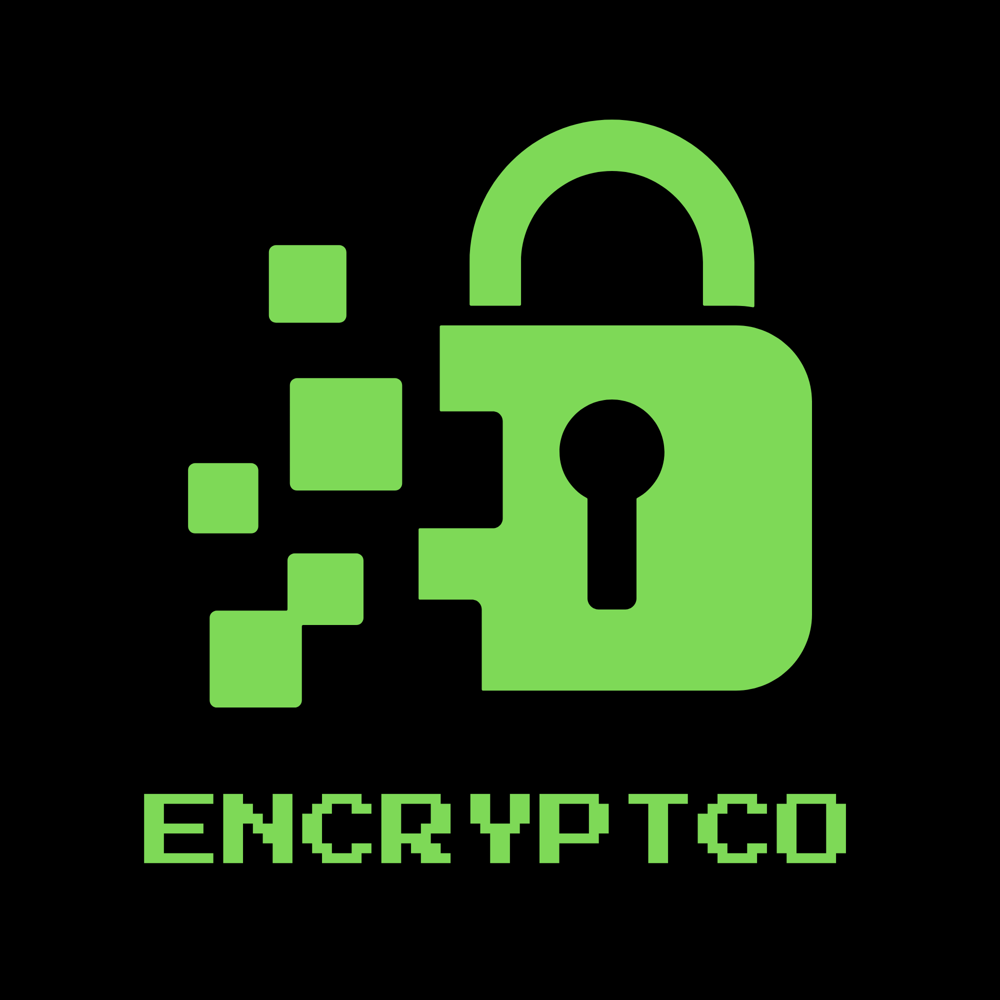

# 🟥 Encrypto

<p align="center">
  
</p>

**Now - noone can see what you're saying.**

Run the app. Enter some text. Choose a key. Done.

## Script features
* 📃 **Encryption** Easily encrypt text and decrypt text
* 🌊 **Redesigned for perfection** Easy to install. Download. Cd. Done.
* 💻 **Simple and lightweight** Encrypto loads instantly, and stays instantly.

## 🛠️ Tech Stack
* **Frontend / Backend:** Python

## 🌐 How to use Encryptco
1. Make sure Encryptco is installed! If it isn't, check the Installation page below.
2. Run Encryptco by double-clicking `app.py` in the folder you put Encryptco in.
3. Select between:
   - **Encrypt** - encrypt text so no one else sees it.
   - **Decrypt** - decrypt the text that your friend sent to you.
   - **Exit** - exit the app.

Select the option you want. Then enter the text you want to encrypt/decrypt. Choose a key between `0-10000000`. Make sure only you and your friend know this key. Press Enter and you're all done!

---

# ⚡ Lightning installation
*(Seriously, a 2yo could do this. Watch the video if you're still confused.)*

<p align="center">
  <video src="git_assets/video.mp4" controls width="800">
    Your browser does not support the video tag.
  </video>
</p>

1. **Download** the installer by going to:
   https://github.com/andomatthew1234/encryptco/releases/latest/
2. **Double click** installer.bat
3. **Select** run to confirm the file will download

*Windows may give you a scary "Publisher not verified" warning. That's expected because the installer isn't code-signed.*

### How the installer works

- Downloads the latest version of Encryptco (the whole ZIP file)
- Extracts the ZIP to a folder
- Opens that folder in the terminal and runs `setup.bat`

The `setup.bat` file will:

- Check Python is installed (and install it if it isn't)
- Install all required packages
- Deploy the application

---

# ... Other installation types

## Medium setup
*(Try this if Lightning doesn't work.)*

1. Download Encrypto by clicking the **Code** button at the top of the page > **Download ZIP**
2. Extract Encrypto by right-clicking the folder you downloaded > **Extract All**
3. Double-click on `setup.bat`. Our installer will:
   - Make sure Python is installed (and install it if it isn't)
   - Download all required files
   - Make sure you're ready to go
4. Run Encryptco by double-clicking `app.py`

---

## Manual setup
*(Not recommended.)*

It takes a few minutes, but here's how to install Encryptco.

### 1. Make sure Python is installed

The Python software must be installed to run Encryptco.

If you don't have it, get it from the Microsoft Store:

https://apps.microsoft.com/detail/9ncvdn91xzqp?hl=en-GB&gl=AU

To confirm Python is installed:

Open Terminal or PowerShell and type:

```text
python --version
```

If it doesn't come back with a red error, you're ready to go.

### 2. Download the files

- Press the green **Code** button
- Select **Download ZIP**
- Open File Explorer
- Go to **Downloads**
- Right-click the ZIP file
- Select **Extract All**

### 3. Run the application

Double-click `app.py`.

If this does not work:

- Right-click `app.py`
- Select **Open with**
- Choose **Python**

### 4. Use the app!

You're ready to encrypt and decrypt messages.

---

## 💡 Tip

You can pin Encryptco to the taskbar for easy access.

1. Right-click `app.py`
2. Select **Create shortcut**
3. Customize the icon and name if you want
4. Right-click the shortcut
5. Select **More options**
6. Select **Pin to taskbar**

---

*Created by Matthew Anderson*